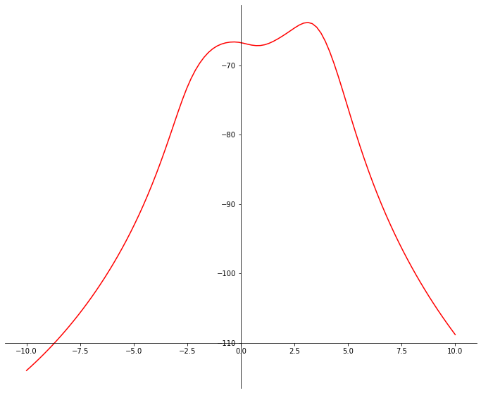

# Problem 1 (30 points)

The idea of fixed point algorithm and its procedures are given in the note. Write a function to implement the fixed-point algorithm.


# Problem 2 (30 points)

The Cauchy($\theta$, 1) distribution has the following probability density function

$$f(x\,|\,\theta) = \frac{1}{\pi[1+(x-\theta)^2]},$$

where $\theta$ is the unknown parameter.

Suppose $x_1$, $x_2$, $\dots$, $x_n$ are observed independent sample from the Cauchy distribution, then the loglikelihood function for the data can be written as:

$$\ell(\theta) = -n\log \pi - \sum_{i=1}^n \log (1+(x_i-\theta)^2).$$

The maximum likelihood estimator (mle) for $\theta$, denoted as $\theta_0$, is then the solution of the following equation

$$\ell'(\theta) = \frac{d\ell(\theta)}{d\theta} = -2\sum_{i=1}^n \frac{\theta-x_i}{1+(\theta-x_i)^2} = 0.$$

Then, the root finding techniques we have learned can be used here. Essentially, we are looking for $\theta_0$ such that $\ell'(\theta_0) = 0$.


## Part (a)

Now, suppose our observed data $x_i$'s are defined in a list called data such that:

```python
data = [-2.44, 3.29, 3.71, -2.40, 4.53, -0.07, -1.05, -13.87, -2.53,
        -1.75, 3.30, 1.77, -0.23, 2.76, 3.80, 3.47, 56.75, -1.34, 4.24]
```

Given the data, the log-likelihood function can be shown in the following plot. Use the **newton method** you wrote during the class, find the maximizer for the log-likelihood function.



**Hint**:

1.  The newton method requires the derivate of function $\ell'$, $\ell''$. The expression for $\ell''$ is given below: $$\ell''(\theta) = -2\sum_{i=1}^n \frac{1-(\theta-x_i)^2}{[1+(\theta-x_i)^2]^2}$$
2.  Given the $x_i$'s in list called data, if you want to write a function such that $$g(\theta) = \sum_{i=1}^n (\theta-x_i)^2,$$ one possible way is

```
def g(theta):
    return(sum([(theta-x)**2 for x in data]))
```

3.  SET **init = 4** and set **max<sub>iter</sub> = 100**.


## Part (b)

Use the **Fixed point** method to solve the problem in part (a).

**Hint**:

1.  try two different values for **alpha = -0.25 and 0.125**.
2.  set **init = 4**.
3.  set **max<sub>iter</sub> = 100**.
