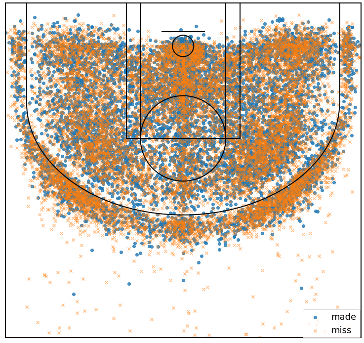

# Problem 1 (40 pts)

The file "`Game_of_Thrones_Script.csv`" contains line script for characters across 8 seasons. Use this file, answer the following question. You may need to set `keep_default_na=False` when loading the data, e.g.,

```python
import pandas as pd
pd.read_csv("Game_of_Thrones_Script.csv", keep_default_na=False)
```


## part (a) - 5 pts

How many characters are there across all 8 seasons?


## part (b) - 5 pts

How many characters are there in each season?

**Note:** These numbers do not have to add to the number you get in part (a).


## part (c) - 5 pts

Which episode has the least number of characters?


## part (d) - 5 pts

which episode has the most line of sentences in total?


## part (e) - 5 pts

Across all 8 seasons, list the top 5 charaters who had the most sentences and how many sentences they have said.


## part (f) - 5 pts

For season 3, list the top 5 charaters who had the most sentences and how many sentences they have said.


## part (g) - 5 pts

Based on the **Sentence** column, create a new column called `num_words` which gives the total number of words in the sentence.


## part (h) - 5 pts

For numeric variables, we can use some quantities to summarize. For this part, first split the data based on season. Then, for variable `num_words`, calculate

-   minimum
-   mean
-   median
-   maximum
-   summation

What can you tell based on your results?


# Problem 2 (30 pts)

For this problem, you are given 3 data files

-   purchases: contains purchases record March 2019 - June 2019.
-   customers: contains information about customers.
-   products: contains information about products.

First, import all 3 data files.

**Note**: When importing customers.csv and products.csv, you may want to set `index_col="customer_id"` and `index_col="product_id"`.


## part (a) - 10 pts

Using purchases as the left table, use left join to join **purchases** and **customers** together. In this case, since both tables contain column `customer_id`, so this column can be used as key for the joining. To do this, you need to set `on='customer_id'` in the `join` method. Name this joined table as **purchase1**.

Using DataFrame **purchases1**, find the frequency of purchases for different gender group.


## part (b) - 10 pts

Using purchases1 as the left table, use left join to join **purchases1** and **products** together. In this case, since both tables contain column `product_id`, so this column can be used as key for the joining. To do this, you need to set `on='product_id'` in the `join` method. Name this joined table as **purchase2**.

List the top 5 best selling products (based on the **amount** sold).


## part (c) -10 pts

Repeat part b for each gender group: What are the top 5 best selling products for male and female group?

**Note**: One possible way to do this is to first create two new DataFrames for each gender. Then repeat what you did in part b.


# Problem 3 (20 pts)

The file "`Kobe_data.csv`" contains shot records of NBA basketball player Kobe Bryant for his career. Below is a figure about all the shots made by Kobe.




## Part (a) - 10 pts

Create a **relative** frequency table using `combined_shot_type` and `shot_zone_range` and set `margins=True`.


## part (b) - 5 pts

As we talked during the class, this relative frequency table give the empirical probabilities associated with different categories. Based on the table, what is kobe's most commonly used shoting type?


## part (c) - 5 pts

For shots made less than 8ft, what is Kobe's most commonly used shoting type? What is the empirical conditional probability here?

**Hint**:

Conditional probability of A given B can be calculated by:

$$P(A|B) = \frac{P(A \cap B)}{P(B)}$$
